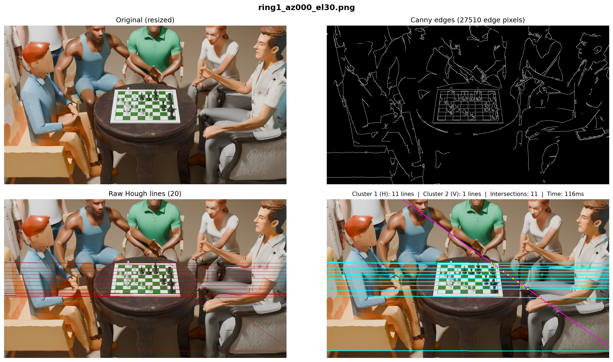
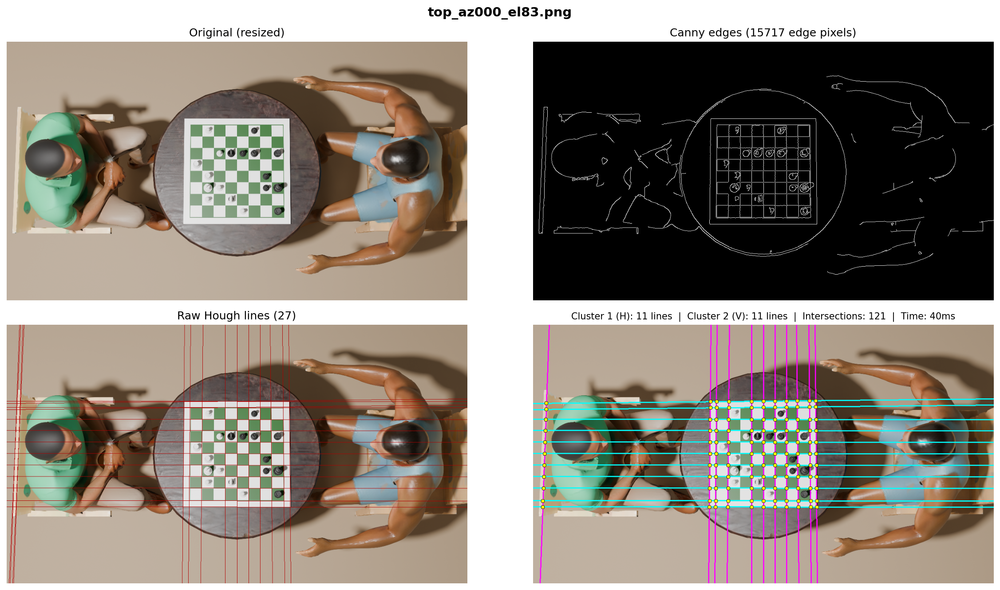

# KnightVision Chess Dataset

This repository is a small part of a larger Computer Vision pipeline for detecting chess boards and chess positions from live, over the board games. Since hand labeling data can be expensive and time consuming, synthetic data is used instead. Models of chess boards and players/spectators were created in Blender and used to simulate different chess positions and scenarios that occur in OTB games.

Since it's synthetic data, it is well labeled with the segmentation mask, bounding boxes and other important data about the pieces, chess board, humans, etc.

We also test classic computer vision techniques like the canny operator, RANSAC to detect chess boards.

## Sample Outputs

## Repository Structure

- **scripts/**: Python scripts for Blender automation.
    - `01_scene_analysis.py`: Analyzes the scene and maps object positions.
    - `02_camera_rig.py`: Generates camera configurations.
    - `03_render_pipeline.py`: Main rendering loop with Cryptomatte segmentation.
    - `04_configurations.py`: Defines scene scenarios (crowded, sparse, occlusion).
    - `utils.py`: Shared math and geometry utilities.
- **v4/**: Dataset version 4 containing images and annotations.
